# drmon User Manual

**drmon** — the *Developer Resources Monitor* — is a source-level debugger/monitor for cartridge-console
development. It targets the **SNES** (Nintendo 65816) and **Genesis** (68000); this build is
SNES (`SNESMon`). Originally a 1990s DOS product (Developer Resources, 1991–1994; the title bar
reads **SNESMon V2.1.30**), it has been ported to Linux as a wide-ncurses terminal application.

This manual covers everything you can do today. To install/launch see
[Installation](install.md); to configure see [Configuration](configuration.md).

> ### ⚠ Connect to a MAME target — or it runs disconnected
> The Linux port renders the full UI and lets you drive every window, evaluate expressions, load
> symbols, and script commands. The **Phase 2 MAME backend (done)** adds a live target: launch MAME
> with your cart and the bridge (`task mame SYS=snes|gen CART=…` — see [Installation](install.md)),
> then `snesmon`/`genmon` connects and Run/Stop/Step, target memory, registers, and breakpoints all
> operate on the running game. **Without a connection**, drmon runs *disconnected*: the UI still
> works, but target memory/registers read as zero and Run/Stop/Step do nothing. Throughout this
> manual, features that need a live connection are marked **(needs a connected target)**. (One thing
> stays unwired even when connected: the target's print channel → Console — see Limitations.)

---

## Getting started

Launch with `task run` (see [Installation](install.md)). You land on the drmon **desktop**: a
menu bar across the top, a live clock in the top-right, and a status line at the bottom showing
the version and run state (`Running` / `Stopped`).

- Press **F10** to enter the global **menu bar**; ←/→ move between menus, **Enter** opens one,
  ↑/↓ pick an item, **Esc** cancels.
- Open windows with **Alt+letter**:

  | Key | Window | Key | Window |
  |-----|--------|-----|--------|
  | `Alt+M` | Memory | `Alt+K` | Command |
  | `Alt+R` | Register | `Alt+W` | Watch |
  | `Alt+B` | Breakpoint | `Alt+T` | Text View |
  | `Alt+L` | Source | `Alt+I` | Project Info |
  | `Alt+O` | Console | `Alt+A` | About |
  | `Alt+S` | Symbol | `Alt+Y` | ASCII chart |
  | `Alt+E` | Expression | `Alt+N` | SPC Register *(SNES)* |
- **F6** cycles between open windows; **Alt+Q** closes the front one; **F9** enters window
  *movement mode* (arrows move, Shift+arrows resize, Esc leaves).
- **Alt+X** quits. **Ctrl+C does not quit the monitor** — it clears the breakpoint under
  the cursor in window-specific contexts (Memory, etc.); quit via Alt+X or File ▸ Exit.
- **F1** opens this manual's ancestor, the built-in `snesmon.hlp` key card. (That in-app card is
  the original ~1994 reference and has drifted from the current bindings — **this manual is
  authoritative** where they disagree.)

---

## Concepts

| Concept | What it is |
|---------|-----------|
| **Symbols** | Named values/addresses (e.g. `Main = $8000`). Created by hand, or loaded from a `.sld` (Source-Level Debug), COFF, ca65 `.dbg`, WLA-DX `.sym`, or **ELF/DWARF** (e.g. an llvm-mos `-g` build's `<rom>.elf` companion) object file. They drive source-level debugging: set a breakpoint on `Main`, watch `score`, jump to a label. |
| **Source-level debug info** | A `.sld`, COFF, ca65 `.dbg`, WLA `.sym`, or **ELF/DWARF** file maps source file + line ↔ address, so the Source window can show the line your PC is on and you can break by line. For **editor** debugging (VS Code / Emacs / Neovim) over the DAP adapter, see [`dap-setup.md`](dap-setup.md). |
| **Breakpoints** | Stop execution at an address. Variants: plain, **once** (clears after firing), **count** (fires N times then clears), and **conditional** (an expression must be true). *(needs a connected target to actually fire)* |
| **Watchpoints** | Expressions re-evaluated every frame and displayed as `value : expression`. Pure monitor-side — handy for tracking a variable or a computed value. |
| **Step / Step Over / Run** | Single-step one instruction (**F7**), step over a call (**F8**), or run freely (**F2**) / stop (**F3**). Source- and assembly-level step variants exist (see key reference). *(needs a connected target)* |
| **65816 disassembler** | Decodes SNES machine code to assembly; powers the Memory window's disassembly view. |
| **SPC700 (SNES audio CPU)** | The SNES's second processor, which runs the sound engine. drmon exposes it through two SNES-only surfaces: the **SPC Register** window (`Alt+N`) for its registers, and the Memory window's **SPC RAM** view (`Ctrl+R`) for its 64 KB address space. Independent of the main 65816 — its own registers and memory. |
| **Dev-link (SLIO)** | The command protocol that talks to the target (read/write memory+registers, set/clear breakpoints, step, run). The **Phase 2 MAME backend** implements it: one `sliomame.cpp` client drives a per-platform Lua bridge over TCP — `mame_bridge.lua` (SNES) or `mame_genesis_bridge.lua` (Genesis), both built on the shared `mame_cpu_bridge.lua`, under `-debugger none`. `linux/slio_stub.cpp` is the no-op fallback when `DRMON_MAME_BACKEND=OFF`. |

---

## Windows & views

drmon's UI is a set of windows you open from the **Windows** menu or by Alt-key. Windows marked
**(single)** allow only one instance at a time. Each window's own shortcuts are listed with it;
global keys are in the [Key reference](#key-reference).

### Memory — `Alt+M`
Examine memory as bytes, words, long words, ASCII, or disassembled code — and, on SNES, the
SPC700 audio CPU's RAM (`Ctrl+R`). Navigate with the arrows / PgUp / PgDn. *(values read as zero
when disconnected)*

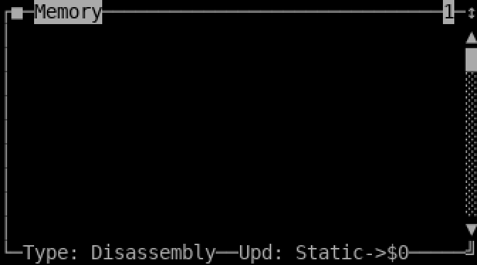

| Key | Action | | Key | Action |
|-----|--------|---|-----|--------|
| `Ctrl+B` | view as bytes | | `Ctrl+G` | go to address |
| `Ctrl+W` | view as words | | `Ctrl+M` | modify memory at cursor |
| `Ctrl+L` | view as long words | | `Ctrl+S` | set breakpoint at cursor |
| `Ctrl+D` | view as disassembly | | `Ctrl+O` | set break-once at cursor |
| `Ctrl+Y` | view as ASCII | | `Ctrl+N` | set break-with-count at cursor |
| `Ctrl+R` | view as **SPC RAM** *(SNES)* | | `Ctrl+C` | clear breakpoint at cursor |
| `Ctrl+H` | run to cursor | | `Ctrl+A` | clear all breakpoints |

The view mode is also on the window's local menu (**Ctrl+F10 ▸ Memory Type**), which lists every
mode including target-specific ones — **PPU** (VRAM) and **SPC RAM** on SNES.

**View modes:**

| Bytes (`Ctrl+B`) | Words (`Ctrl+W`) | Long words (`Ctrl+L`) |
|---|---|---|
| 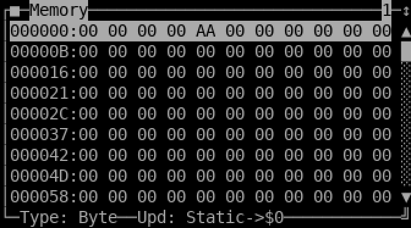 | 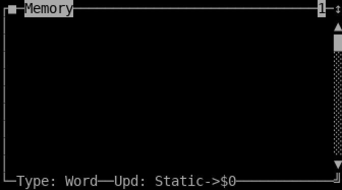 |  |

| Disassembly (`Ctrl+D`) | ASCII (`Ctrl+Y`) |
|---|---|
|  |  |

**SPC RAM (`Ctrl+R`, SNES).** A byte dump of the SPC700 audio co-CPU's 64 KB address space —
the audio program/data RAM, the SPC I/O ports at `$00F0–$00FF`, and the IPL boot ROM at
`$FFC0–$FFFF`. Scroll/goto like any byte view. The status line reads `Type: SPC RAM`. The bytes
come from a separate read channel than the main 65816 bus. *(reads as zero when disconnected)*

```
┌■─Memory──────────────────────────────1─↕
│00FFC0:CD EF BD E8 00 C6 1D D0 FC 8F AA ▲
│00FFCB:F4 8F BB F5 78 FA AA 78 …         █
└─Type: SPC RAM ─Upd: Static->$FFC0──────╝
```

### Register — `Alt+R` (single)
View and set the current 65816 registers (A, X, Y, P/flags, D, DB, PB, SP, PC); flags are shown
individually. Click a register to open an Expression window prompting for a new value.
*(live values need a connected target)*

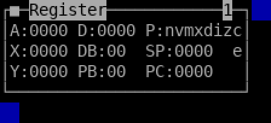

### SPC Register — `Alt+N` (single, SNES)
The SNES has a second CPU — the **SPC700** audio co-processor. This window shows and edits its
registers: **PC, A, X, Y, SP**, and the **PSW** status flags (`N V P B H I Z C`, upper-case when
set). Like the main Register window, click a register to open an Expression prompt and type a new
value — it's written straight back to the running SPC700. Pairs with the Memory window's
**SPC RAM** view (`Ctrl+R`) for the audio CPU's memory. *(live values need a connected target)*

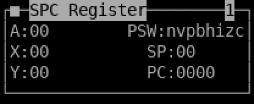

### Breakpoint — `Alt+B` (single)
List and manage breakpoints.

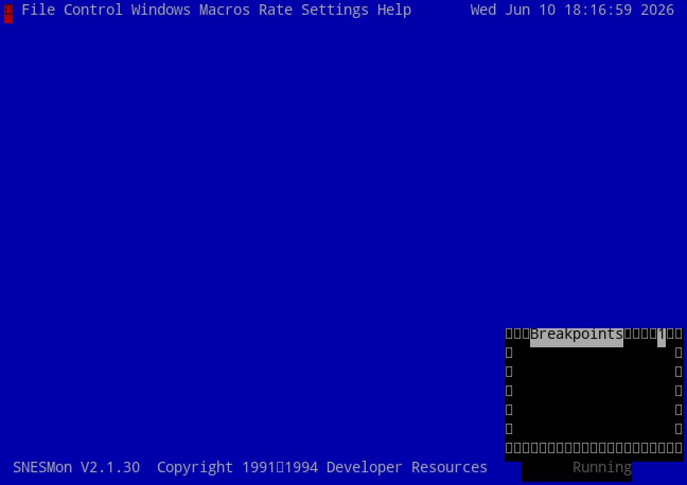

| Key | Action |
|-----|--------|
| `Ctrl+S` | set |
| `Ctrl+O` | set once |
| `Ctrl+N` | set with count |
| `Ctrl+E` | set conditional |
| `Ctrl+C` | clear under cursor |
| `Ctrl+A` | clear all |
| `Ctrl+T` | toggle on/off |

### Watch — `Alt+W`
Monitor expressions; each row shows `value : expression`, updated every frame.

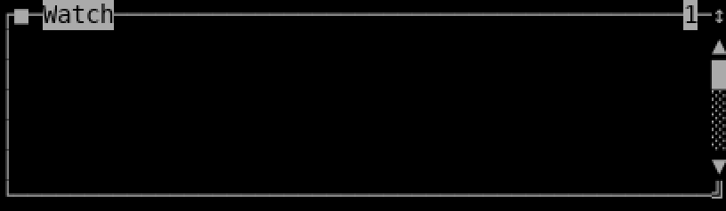

| Key | Action |
|-----|--------|
| `Ctrl+S` | add a watch |
| `Ctrl+C` | clear under cursor |
| `Ctrl+A` | clear all |

### Symbol — `Alt+S` (single)
Create, delete, and load symbols.

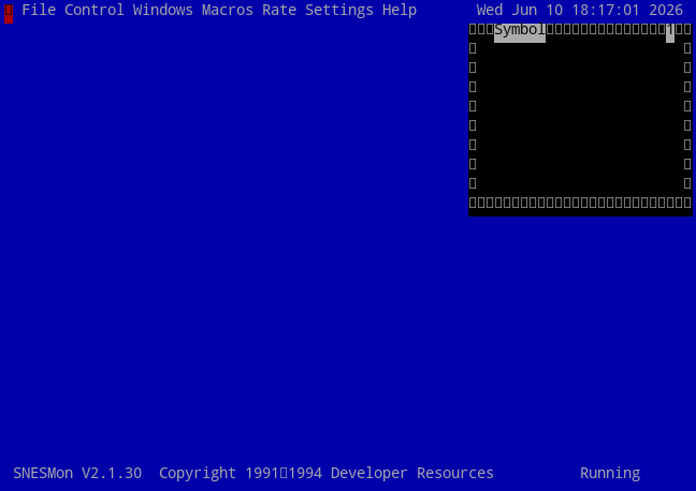

| Key | Action |
|-----|--------|
| `Ctrl+L` | load a symbol file |
| `Ctrl+S` | define a new symbol |
| `Ctrl+C` | delete under cursor |
| `Ctrl+A` | clear all |
| `Ctrl+B` | set breakpoint at the symbol |
| `Ctrl+O` | set break-once at the symbol |

### Expression — `Alt+E` (single)
A calculator for symbols and expressions; results show in **hex, decimal, and binary**, plus the
first matching symbol. See [Expression language](#expression-language). No menu; results can be
copied and pasted into other input fields.

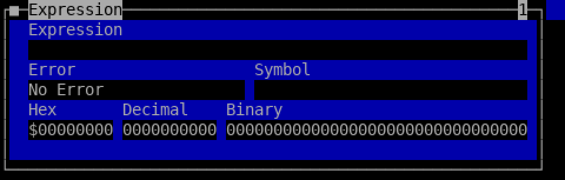

### Command — `Alt+K` (single)
Type [console commands](#console-command-language); responses print here. More powerful than
keyboard macros, with scripting (`.scr`). **↑/↓** walk the command history.

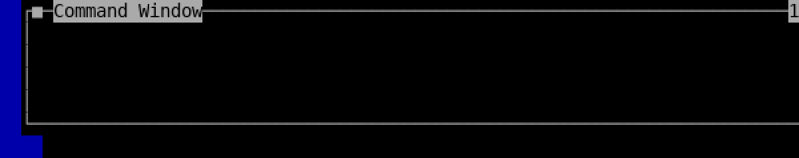

### Source — `Alt+L` (single)
Source-level debugging: load a `.sld` file (`Ctrl+L`) to view the source the code was assembled
from and set breakpoints by line.

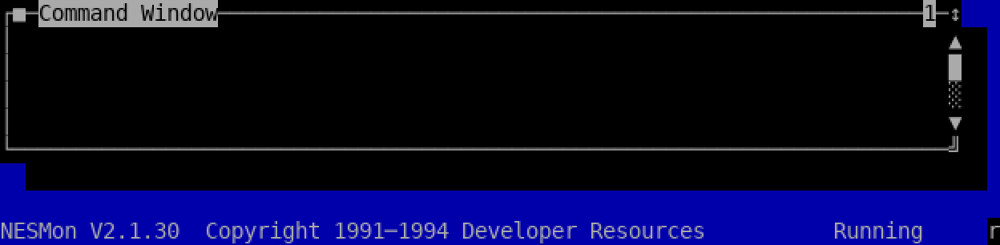

| Key | Action |
|-----|--------|
| `Ctrl+F` | find |
| `Ctrl+N` | find next |
| `Ctrl+R` | search label |
| `Ctrl+G` | go to line |
| `Ctrl+S` / `Ctrl+O` / `Ctrl+C` / `Ctrl+A` | set / once / clear / clear-all breakpoints |
| `Ctrl+H` | run to line |
| `Ctrl+Y` | go to symbol |

### Text View — `Alt+T`
A generic text-file viewer. Arrows move the cursor; PgUp/PgDn page.


| Key | Action |
|-----|--------|
| `Ctrl+L` | load |
| `Ctrl+F` | find |
| `Ctrl+N` | find next |
| `Ctrl+G` | go to line |

### Console — `Alt+O` (single)
Read-only output the *target program* prints via the dev-package print routines. `Ctrl+C` clears
it. *(empty until connected)*

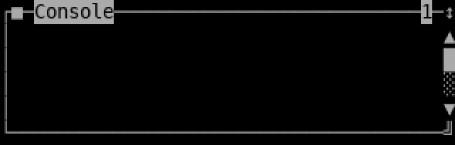

### ASCII chart — `Alt+Y`
A reference table of character codes (decimal / hex / the CP437 glyph).

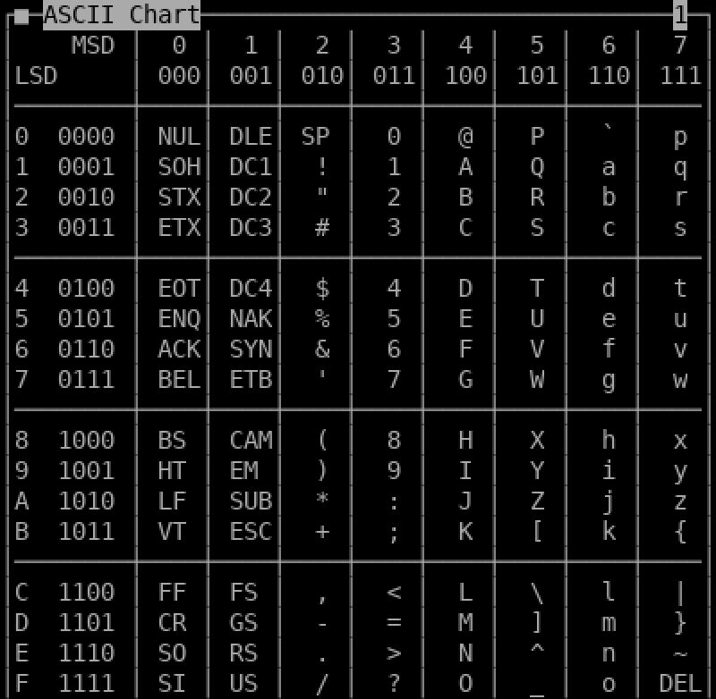

### Project Info — `Alt+I` (single)
Shows free memory and symbol counts.

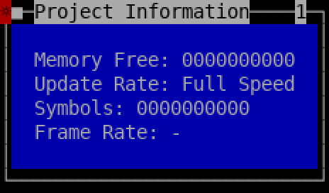

### About — `Alt+A`
Shows version and credits.

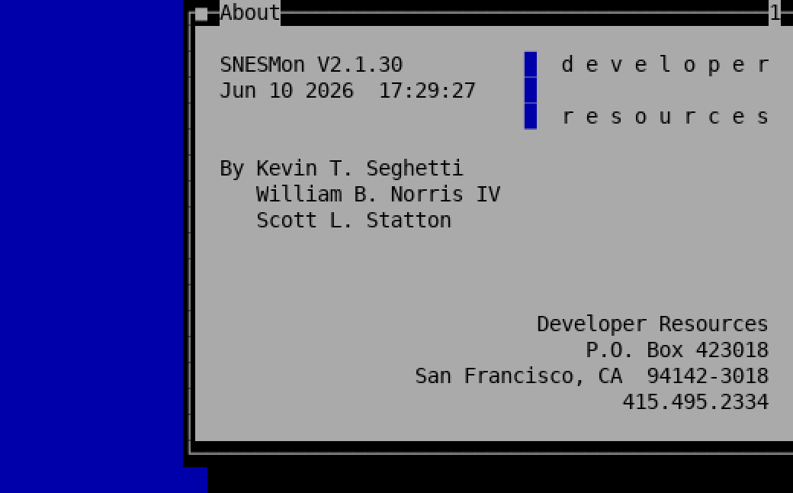

### Help — `F1`
The built-in `snesmon.hlp` key card, shown in a Text View window.

---

## Key reference

The authoritative bindings for this Linux build (from `monkeys.hpp`).

### Execution & windows (global)

| Key | Action | Key | Action |
|-----|--------|-----|--------|
| `F1` | Open Help | `F9` | Window movement mode |
| `Ctrl+F1` | Window-specific help | `F10` | Global menu bar |
| `F2` | Run *(backend)* | `Ctrl+F10` | Local (window) menu |
| `F3` | Stop / Break *(backend)* | `F6` | Next window |
| `F4` | Run, no screen update *(backend)* | `Alt+Q` | Close window |
| `F7` | Step Into / Trace *(backend)* | `Alt+X` | Quit |
| `F8` | Step Over *(backend)* | `Alt+Z` | Zoom window |
| `Ctrl+F7` / `Ctrl+F8` | Step Into / Over (assembly) | `Alt+P` | Log window to file |
| `Alt+F7` / `Alt+F8` | Step Into / Over (source) | | |

### Text-field editing (string gadgets)

| Key | Action |
|-----|--------|
| `Alt+U` | cut |
| `Alt+C` | copy |
| `Alt+V` | paste |

Shift+left-click and drag selects text to the clipboard.

### Window movement mode (`F9`)

Arrows move the window; **Shift+**arrows resize it; **Esc** or **Enter** leaves the mode.

---

## Menu reference

Press **F10** for the menu bar (Ctrl+F10 for a window's local menu). The top-level menus:

- **File** — Load binary / COFF, *Execute Script…*, Exit (Alt+X).
- **Control** — Run (F2), Stop (F3), Run no Update (F4), Step (F7), Step Over (F8), Reset Slave,
  Reset to Monitor, Write-Protect ▸ On/Off, Break on ROM Write ▸ On/Off. *(need a connected
  MAME target. Write-Protect / Break on ROM Write arm a MAME write-watchpoint over the ROM
  window — both halt the CPU on a write, since MAME can't silently block one. Now active on
  **genmon** too (the Lua bridge watches M68K cartridge ROM `$000000-$3FFFFF`), not just snesmon.)*
- **Windows** — open any window (mirrors the Alt-keys above).
- **Macros** — Create Macro, Load / Save Macro File, Delete All Macros.
- **Rate** — screen update speed: Full Speed, 18 FPS, 9 FPS, 4 FPS.
- **Settings** — Set Source Path…, Load / Save INI Settings, Set Log File…
- **Help** — Index, Keyboard, Commands, Using Help, About.

---

## Console command language

Open the Command window (**Alt+K**) and type commands; one per line. Scripts (`.scr`, see
[Configuration](configuration.md)) are the same commands batched. Lines beginning with `;` (or
`#`) are comments.

**Windows.** `OPEN <window>`, `CLOSE [<window>]`, `POSITION [<window>] <x> <y>`,
`SIZE`/`RESIZE [<window>] <w> <h>`, `NAME [<window>] <newname>`, `SELECT`. Window names:
`MEMORY REGISTER BREAK WATCH SYMBOL CONSOLE EXPRESSION COMMAND SOURCE TEXTVIEW SEARCHLIST`.

**Symbols & memory.**
- `name = value` — define/assign a symbol (e.g. `pcl = $C00000`).
- `@[size]addr = value` — write target memory *(needs a connected target)*.
- `BSET <addr>` / `BCLEAR <addr>` — set / clear a breakpoint.
- `LOADSYM <file>` / `SAVESYM <file>` · `SCLEAR <symbol>`.
- `LOADBINARY <addr> <file>` / `SAVEBINARY <addr> <len> <file>` *(backend)*.

**Execution** *(all need a connected target)*: `STEP`, `OVER`, `STOP`, `RUNWITHUPDATE`, `RUNNOUPDATE`,
`RESET`, `RESTART`, `HIT`.

**Scripting & misc.** `EXECUTE <file>` (run a `.scr`), `WAIT <ms>`, `SET <param> <value>`,
`LOADMACRO`/`SAVEMACRO <file>`, `HELP`, `QUIT`, `?`.

**Macros.** Define a keyboard/console macro with `name: command text`.

Parameters that modify commands include `BYTE WORD LONG CODE ASCII ALPHA` (display formats),
`DYNAMICRUNNING DYNAMICUPDATE STATIC` (memory tracking modes), `ON OFF ALL ADD CLEAR SORT VALUE`,
and `PPU` (SNES). Commands and parameters are case-insensitive.

---

## Expression language

Used in the Expression window, Watch expressions, conditional breakpoints, and the command
shell (grammar in `expr.l` / `expr.y`).

**Number bases:**

| Form | Example | Meaning |
|------|---------|---------|
| decimal | `1234` | base 10 |
| hex (`$`) | `$DEAD` | base 16 |
| hex (`0x`) | `0xDEAD` | base 16 |
| binary (`%`) | `%1111.0000` | base 2 (`.` separators ignored) |
| binary (`0b`) | `0b11110000` | base 2 |

**Operators** (highest-binding last; standard C-like precedence):

- Arithmetic: `+` `-` `*` `/` `%` and unary `-`, `++`, `--`
- Bitwise: `&` `|` `^` `~` `<<` `>>`
- Logical: `!` `&&` `||`
- Comparison: `<` `<=` `>` `>=` `==` `!=`
- Conditional: `cond ? a : b`
- Grouping: `( … )`

**Symbols.** A bare identifier (`[A-Za-z][A-Za-z0-9]*`) is a symbol; referencing one looks it up
(creating it if new). Assign with `name = expr`.

**Memory read.** `@size(addr)` reads `size` bytes at `addr` — e.g. `@2($1000)` reads a 16-bit
word. *(returns 0 when disconnected)*

**Functions.** `numberofones(x)` — population count (number of set bits). Function calls use
`name(arg)` syntax.

Results display in hex, decimal, and binary, plus the first symbol matching the value.

---

## A typical session

The intended source-level workflow (live steps need a connected target):

1. **Load symbols / source.** Symbol window (`Alt+S`, `Ctrl+L`) → load your `.sld`/COFF; or
   `loadsym game.sld` in the Command window. Open Source (`Alt+L`, `Ctrl+L`).
2. **Set breakpoints.** In Source or Memory, put the cursor on a line/address and press `Ctrl+S`
   (or `BSET <addr>` / break on a symbol from the Symbol window).
3. **Run.** `F2` (Run) → drmon stops when a breakpoint fires. *(backend)*
4. **Step.** `F7` step into, `F8` step over, watching the Source/Memory/Register windows. *(backend)*
5. **Inspect.** Open Memory (`Alt+M`), Register (`Alt+R`), and Watch (`Alt+W`); evaluate ad-hoc
   values in the Expression window (`Alt+E`).
6. **Iterate.** Adjust breakpoints/watches and continue.

Today you can do steps 1–2, 5 (expression evaluation, symbol/watch/breakpoint *setup*, window
layout) and scripting; steps 3–4 and live memory/register/console come online with a backend.

---

## Connected vs disconnected

drmon needs a live MAME target for execution and target I/O. Connect by launching MAME with the
bridge (`task mame SYS=snes|gen CART=…`) before or while running `snesmon`/`genmon`; the client
reconnects automatically. **When connected**, Run/Stop/Step, target memory & registers, breakpoints,
the SNES PPU and SPC RAM memory windows, the SNES SPC700 register window, and SNES write-protect /
break-on-ROM-write all work. **When disconnected** (no MAME running, or the bridge socket is down):

- **Run / Stop / Step** (F2/F3/F7/F8 and the `STEP`/`OVER`/`RUN…` commands) have no effect.
- **Target memory & registers** read as zero; memory/register *edits* and `@…` reads/writes go
  nowhere.
- **Breakpoints / watches / conditional breaks** can be created but never fire.

Wired in Phase 2 but still incomplete, even when connected:

- **Console** receives nothing — the target's print channel isn't carried over the bridge yet.

When connected, live non-CPU state reads now work on **both** targets: the SNES PPU/VRAM, SPC700
registers, and SPC RAM windows, and the Genesis **VDP / CRAM / VSRAM / Z80** windows — readable at
a breakpoint (the M68K shares one `-debugger none` channel with its non-CPU state).

See [BUGS.md](../../../../docs/BUGS.md) for fixed issues and the
[port plan](../../../../docs/plans/2026-06-10-port-drmon-linux.md) for the phased roadmap.
