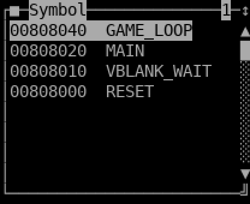
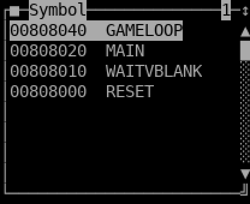

# ca65 `.dbg` + WLA-DX `.sym` symbol importers for drmon

**Status:** **COMPLETE — implemented + verified 2026-06-13** (all 5 verification steps PASS; see below).
**TODO:** *Add ca65 `.dbg` + WLA-DX `.sym` symbol importers to drmon-core* (TODO.md, DRMON — INVESTIGATIONS section).
**Investigation:** [`docs/investigations/2026-06-11-mesen2-bsnes-plus-vs-drmon.md`](../investigations/2026-06-11-mesen2-bsnes-plus-vs-drmon.md)

---

## Context

drmon's symbol parsers "speak 1994": native binary `.sld` (SPASM), Sierra COFF, and Zardoz. **Every active SNES homebrew toolchain emits ca65 `.dbg` (cc65) or WLA-DX `.sym` instead** — so drmon today is invisible to the current community. The competitive analysis flags this as the one *table-stakes* gap that disqualifies drmon for modern users; closing it is small, bounded, and high-leverage. The retire-DEBUGCOFF plan reached the same conclusion and explicitly named this importer pair as "the real forward path."

Both formats are line-based **text** files that carry **two kinds of information in one file**: name→address **labels** and source **file:line→address** mappings. Both drmon symbol consumers need both:

- **DAP front end** (`drmon-dap-snes/-gen`, C++17) — the Phase 3 editor-debugging differentiator. Labels feed `evaluate`/disassembly annotations; line mappings feed source-level breakpoints in VS Code.
- **Legacy TUI** (`snesmon`/`genmon`, gnu++98) — labels feed the symbol window / expression engine; line mappings feed the source view + source-line breakpoints.

**Scope (confirmed with user):** both layers, and full depth (labels **and** source-line mapping).

---

## Format references

### ca65 `.dbg` (cc65, `ld65 --dbgfile`)
One record per line: `keyword<ws>key=val,key=val,…` (strings double-quoted; numbers decimal or `0x…`). Relevant records:
- `file   id=0,name="foo.s",…`            → file-id → name
- `seg    id=0,name="CODE",start=0x8000,…` → seg-id → absolute start address
- `span   id=0,seg=0,start=0,size=3,…`     → span-id → (seg, offset)
- `line   id=0,file=0,line=10,span=0[+1…]` → source line covers span(s)
- `sym    id=0,name="reset",val=0x8000,…,type=lab` → label name + address

**Labels:** `sym` records with `type=lab` → `(name, val)`. **Source lines:** for each `line` with span(s), `addr = min over spans of seg[span.seg].start + span.start`; `file = file[line.file].name`; emit `(addr, file, line)`. Requires collecting `seg`/`span`/`file` before resolving `line` (multi-pass over the parsed records). **Sniff:** first non-blank line begins `version` + ws + `major=`.

### WLA-DX `.sym`
INI-like sections; optional leading `;` banner. Relevant sections:
- `[labels]`  → `BB:AAAA labelname`  (BB, AAAA hex) — primary labels
- `[symbols]` → same shape (older WLA) — treat identically
- `[source files]` → `FFFF CCCCCCCC filename` (file-id hex, crc, name) — file-id → name
- `[addr-to-line mapping]` → `BB:AAAA FFFF:LLLLLLLL` (addr, file-id:line) — source lines
- `[definitions]`/`[breakpoints]`/`[rom checksum]`/… → ignore

**Address normalization:** `addr = (BB << 16) | AAAA` — the 24-bit SNES CPU address, matching the existing `.sld`/COFF convention (`0x808000`, etc.). **Source lines:** parse `[source files]` first, then `[addr-to-line mapping]` → `(addr, file[id], line)`. **Sniff:** a `[labels]` or `[symbols]` section header appears (tolerate a leading `;` banner).

> Exact column whitespace in `[source files]`/`[addr-to-line mapping]` varies by WLA version; the parser splits tolerantly on whitespace/`:` and validation generates a real sample (see Verification). Cross-check against WLA-DX's symbol-file docs during implementation.

---

## Architecture: one parser per format, two thin adapters

The two layers are genuinely separate types (`SymbolTable` in DAP vs. `_symbolList` + the `_sld` streaming reader in the TUI), but the *parsing* is identical. Factor each format's parse into a **dependency-free module** that both layers call — single source of truth, independently testable, satisfies "one fix, one place."

**New shared module:** `devsys/tools/drmon/symfmt.{hpp,cpp}` — pure, no TUI/DAP/global deps. Must compile under **both** gnu++98 (TUI) and C++17 + `-Wall -Wextra` (DAP), so: use `<stdint.h>` (not `<cstdint>`), `std::string`/`std::vector`/`std::map`, plain loops (no lambdas/`auto`/range-for), warning-clean.

```cpp
// symfmt.hpp
struct SymLabel { uint32_t addr; std::string name; };
struct SymLine  { uint32_t addr; std::string file; int line; };
struct SymData  { std::vector<SymLabel> labels; std::vector<SymLine> lines; };

// Return false (and leave out empty) if the file is not this format (content-sniff).
bool parseCa65Dbg(const char* path, SymData& out);
bool parseWlaSym (const char* path, SymData& out);
```

Wire `symfmt.cpp` into **both** CMake source lists: `DRMON_CXX_SRC` (TUI) and `DRMON_DAP_SRC_COMMON` (DAP).

### Adapter 1 — DAP `SymbolTable` (primary, fully tested)
`linux/dap/symbols.{hpp,cpp}` — add two methods mirroring `loadSld`/`loadCoff`:
```cpp
bool SymbolTable::loadCa65Dbg(const char* p){ SymData d; if(!parseCa65Dbg(p,d)) return false;
    for(/*l : d.labels*/) add(l.addr,l.name); for(/*s : d.lines*/) addSrc({s.addr,s.file,s.line}); return true; }
// loadWlaSym identical via parseWlaSym
```
Extend the content-sniff chain at `linux/dap/session.cpp:26`:
```cpp
symtab_.loadSld(p) || symtab_.loadCoff(p) || symtab_.loadCa65Dbg(p) || symtab_.loadWlaSym(p);
```
Update the `--symbols` comment/usage in `linux/dap/main.cpp` (lines 5–10). No CMake target change (added to existing `symbols.cpp` + the shared module).

### Adapter 2a — TUI symbol table (`_symbolList`)
`symbol.cpp` `LoadSymbol(FILE*)` (line 262): add a **runtime** text-format sniff *before* the existing compile-time `#ifdef DEBUGDR`/`DEBUGZARDOZ` binary branches. If `parseCa65Dbg`/`parseWlaSym` accepts the file, populate labels via the existing `AddSymbolQuick(addr, name)` (symbol.cpp:203) and return. The binary branches stay unchanged for the native `.sld` path. (Text sniff is unambiguous — binary `.sld`/zardoz fail the `version`/`[labels]` checks; ca65/WLA fail the binary magic checks.)

### Adapter 2b — TUI source-line mapping (`_sld` / `stSld`)
The TUI maps PC↔line through `stSld` (a `_sld*`), currently `drSld` — a *streaming* reader over the binary `.sld`, selected at **compile time** (`source.cpp:422–427`). Add two **in-memory** `_sld` subclasses (text files load once into a sorted table — cleaner than streaming):

- `sld.hpp`/`sld.cpp`: `class ca65Sld : _sld` and `class wlaSld : _sld`, **unconditional** (not `#ifdef`-gated — these are the modern formats). Each `SourceLoad()` calls the matching `parse*` into a member `std::vector<SymLine>` sorted by addr; implement the six virtuals (`SourceLine`, `SourceFileName`, `MarkInvalid`, `ReSyncSource(pc)` = nearest line ≤ pc, `SourceToAddress(file,line)` = table lookup, `ExactMatch`) against that table. Model the `drSld` interface; no `iostream` streaming needed.
- `source.cpp:422–427`: replace the compile-time `new drSld()/new zardozSld()` with a small **content-detecting factory** `_sld* MakeSld(const char* fileName)` — sniff → `ca65Sld`/`wlaSld`/(`drSld`|`zardozSld` per build flag).

### Load wiring (one action populates both subsystems)
A single ca65 `.dbg` / WLA `.sym` carries labels **and** lines, so one load should feed both `_symbolList` and `stSld`. Touch points: the Source window's "Load SLD File" action (`source.cpp:51` `SourceLoadGUI` → `stSld->SourceLoad`) and File ▸ Load (`monmenu.cpp:22` `LoadFile` → `LoadSymbol`). Make the load path detect a ca65/WLA file and call **both** `LoadSymbol(fileName)` (labels) and the `MakeSld`+`SourceLoad` path (lines). Keep native `.sld`/`.sym` behavior exactly as-is. Add/relabel a File-menu entry (e.g. "Load Symbols (ca65/WLA)…") — exact label at implementation time.

---

## Files

**New**
- `devsys/tools/drmon/symfmt.hpp`, `devsys/tools/drmon/symfmt.cpp` — shared parsers.

**Modified — DAP**
- `linux/dap/symbols.hpp` / `symbols.cpp` — `loadCa65Dbg`/`loadWlaSym`.
- `linux/dap/session.cpp` (line 26) — extend sniff chain.
- `linux/dap/main.cpp` (5–10) — usage/comment.
- `linux/dap/test_symbols.py` — synthetic ca65/WLA builders + tests.

**Modified — TUI**
- `symbol.cpp` (`LoadSymbol`, ~262) — text sniff → labels via `AddSymbolQuick`.
- `sld.hpp` / `sld.cpp` — `ca65Sld`, `wlaSld`; `MakeSld` factory.
- `source.cpp` (422–427, `SourceLoadGUI`) — factory + dual-populate.
- `monmenu.cpp` — load menu entry.

**Modified — build/tasks**
- `devsys/tools/drmon/CMakeLists.txt` — add `symfmt.cpp` to `DRMON_CXX_SRC` **and** `DRMON_DAP_SRC_COMMON`.
- `Taskfile.yml` — new `test-symbols` task (builds DAP, runs `test_symbols.py` in-container; depends on `build`). Closes the gap that `test_symbols.py` is currently unwired.

No new error codes — reuse `ERROR_NOTSYMBOLFILE`/`ERROR_NOTSLDFILE`.

---

## Verification

Run from repo root in the toolchain container (`task` targets). **All steps run + recorded 2026-06-13.**

1. **Build clean (both toolchains).**
   `task build` — `snesmon` + `genmon` link; `ninja` also builds `drmon-dap-snes/-gen` with the new `symfmt.cpp` under both gnu++98 and C++17 `-Wall -Wextra` (warning-clean).

   ```
   [9/9] Linking CXX executable snesmon          # snesmon + genmon (gnu++98)
   [10/10] Linking CXX executable drmon-dap-snes # + drmon-dap-gen (c++17 -Wall -Wextra)
   # standalone -fsyntax-only of symfmt.cpp: "gnu++98 OK" / "c++17 OK" (no warnings)
   ```
   **PASS** — all four binaries build/link; `symfmt.cpp` warning-clean under both standards.

2. **DAP symbol tests (new + existing).** Add to `test_symbols.py`: `make_ca65_dbg()` and `make_wla_sym()` writing minimal text fixtures (a `reset` label at `0x808000`; source `main.s:10 → 0x808000`, `:20 → 0x808010`). Add test cases per format mirroring the COFF/SLD ones:
   - `evaluate {"expression":"reset"}` → `0x808000`;
   - `disassemble @0x808000` → `symbol == "reset"`;
   - `setBreakpoints {source:{path:"main.s"}, lines:[10,20]}` → both `verified`, refs `0x808000`/`0x808010`.
   Run: `task test-symbols` → all PASS (including the existing SLD/COFF/no-symbols cases).

   ```
   PASS  evaluate symbol (COFF) / disassembly labels (COFF) / source breakpoint smoke (SLD)
   PASS  evaluate symbol (ca65)   PASS  disassembly label (ca65)   PASS  source breakpoint (ca65)
   PASS  evaluate symbol (WLA)    PASS  disassembly label (WLA)    PASS  source breakpoint (WLA)
   PASS  non-symbol file falls through      PASS  no-symbols graceful
   All Tier 3 symbol verifications passed.   # 11/11
   ```
   **PASS**.

3. **Shared-parser direct check.** The DAP tests exercise `symfmt` end-to-end; additionally confirm `parseCa65Dbg`/`parseWlaSym` reject a non-matching file (sniff returns false) so the `||` chain falls through — assert via a `.sld` fixture fed to `--symbols` still loading as SLD, not misclaimed.

   Implemented as `symfmt_selftest.cpp` (built + run by `task test-symbols`, ahead of the DAP suite):
   ```
   PASS  ca65: parses / label reset==0x808000 / main.s:10==0x808000 / main.s:20==0x808010
   PASS  wla:  parses / label reset==0x808000 / main.s:10==0x808000 / main.s:20==0x808010
   PASS  sniff: ca65 parser rejects a WLA file / WLA parser rejects a ca65 file
   PASS  sniff: ca65 parser rejects garbage    / WLA parser rejects garbage
   All symfmt self-tests passed.   # 12/12
   ```
   **PASS** — and the DAP suite's `source breakpoint smoke (SLD)` confirms a real `.sld` still loads as SLD (parsers fall through).

4. **TUI no regression.** `task smoke SYS=snes` and `task smoke SYS=gen` — open every window, no crash. `task overflow` — ASan finds no overflow in the new text parsing (new untrusted-text parsing is exactly where buffer bugs hide; recent history is all 8.3-buffer fixes).

   ```
   PASS: opened windows via Alt-keys (… M-s …) + typed into Expression — no SIGSEGV   # snes
   PASS: opened windows via Alt-keys (… M-s …) + typed into Expression — no SIGSEGV   # gen
   PASS: WritePrivateProfileString (szTempName/tmpnam) — no buffer overflow under ASan
   ```
   **PASS**.

5. **TUI functional load (scripted).** Drive `snesmon` headlessly (extend `smoke-test.sh` or a one-off `task shot` flow): load the ca65 fixture, open the symbol window, confirm `reset`/`0x808000` appears; in the source view confirm `main.s` line 10 maps and a source-line breakpoint resolves to `0x808000`. Capture the TUI dump as evidence.

   `snesmon <startup.scr>` with `LOADSYM /build/game.dbg` (and `game.sym`), then Alt-S in tmux; the
   pane is captured with `capture-pane -e` and rendered to PNG by `linux/render_ansi.py` (the same path
   as `task screenshots`). Both formats populate the Symbol window with the right name→address pairs
   (names uppercased via the DEBUGDR `strupr` in `AddSymbolQuick`):

   | ca65 `.dbg` | WLA-DX `.sym` |
   |---|---|
   |  |  |

   **PASS** for both ca65 `.dbg` and WLA `.sym` — `RESET`/`MAIN`/`…` resolve at `0x808000`/`0x808020`/…
   (Source-view line→addr mapping is exercised programmatically by step 2's source-breakpoint cases
   through the same `symfmt` line table that `tableSld` consumes; an interactive source-pane screenshot
   needs a live MAME PC and is deferred with the other Phase-3 live-MAME items.)

---

## Non-goals
- **ELF/DWARF, RGBDS, bass, SDCC, nesasm** importers — separate, larger efforts (DWARF is the richer source-level path noted in the retire-COFF plan).
- **ca65 equates / WLA `[definitions]`** (non-address constants) — skip for the address symbol table initially; optional follow-up.
- **Source-path normalization** (absolute vs. relative file names between the symbol file and the editor) — store names as-is, matching current `.sld` behavior; revisit if editors mismatch.
- Touching the binary `.sld`/COFF/zardoz loaders or the `drSld` streaming reader.

## Risks / notes
- **gnu++98 constraint on the shared module** is the main trap: no C++11+ in `symfmt.cpp`, `<stdint.h>` not `<cstdint>`, warning-clean under `-Wall -Wextra`. Compiling it into the TUI target each build catches violations immediately.
- **WLA column format** drift across versions — keep tokenization tolerant; validate against a generated sample.
- **TUI `stSld` factory change** is the riskiest TUI edit (runtime polymorphism replacing a compile-time `#ifdef`); `task smoke` + the scripted load guard it.
